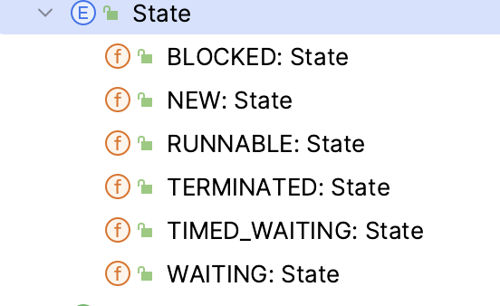

# 概念

- 并发 逻辑上的
- 并行 物理上的
  程序员只关心并发
Thread object with 6 state:


---
# Future Task
FutureTask::get will block main thread and wait the result
```java
    public void play2() throws Exception{
        FutureTask<String> task = new FutureTask<>(
                ()->"hello, world" // callable
        );

        new Thread(task).start();
        System.out.println(task.get());
    }
```
# CompletableFuture

Before join method, completable future already running
```java
public class TimeTool {
    public static void printTimeAndThread(String msg) {
        System.out.println(String.format("%s | %s | %s", LocalTime.now(),Thread.currentThread().getName(),msg));
    }
    public static void sleep(long time) {
        try {
            Thread.sleep(time);
        } catch (InterruptedException e) {
            throw new RuntimeException(e);
        }
    }
}
```

```java
public static void play1() {
        TimeTool.printTimeAndThread("Lee entering restaurant");
        TimeTool.printTimeAndThread("Lee order a menu");

        CompletableFuture<String> future = CompletableFuture.supplyAsync(()->{
            TimeTool.printTimeAndThread("Chef is preparing rice");
            TimeTool.sleep(500);
            TimeTool.printTimeAndThread("Chef is preparing eggs");
            TimeTool.sleep(500);
            return "A great meal";
        });

        TimeTool.printTimeAndThread("Lee is playing game");
        TimeTool.sleep(200);
        TimeTool.printTimeAndThread("Lee is reading");
        TimeTool.sleep(1000);
        TimeTool.printTimeAndThread(String.format("%s is ready, Lee start eating", future.join()));
    }
```
Output:
```shell
> Task :CompletableFuture2023.main()
18:29:25.746662 | main | Lee entering restaurant
18:29:25.750451 | main | Lee order a menu
18:29:25.752134 | main | Lee is playing game
18:29:25.752307 | ForkJoinPool.commonPool-worker-1 | Chef is preparing rice
18:29:25.952846 | main | Lee is reading
18:29:26.255507 | ForkJoinPool.commonPool-worker-1 | Chef is preparing eggs
18:29:26.956378 | main | A great meal is ready, Lee start eating
```
## thenCompose

Param is function:
- the first result will be pass to function's input param,  
- function return a new CompletableFuture object
```java
        CompletableFuture<String> future = CompletableFuture.supplyAsync(()->{
            TimeTool.printTimeAndThread("Chef is preparing rice");
            TimeTool.sleep(500);
            TimeTool.printTimeAndThread("Chef is preparing eggs");
            TimeTool.sleep(100);
            return "A great meal";
        }).thenCompose(meal -> {
            return CompletableFuture.supplyAsync(()->{
                TimeTool.printTimeAndThread("Waiter is preparing drink");
                TimeTool.sleep(500);
                return meal + ", Juice";
            });
        });
```

now we have 3 thread
```shell
> Task :CompletableFuture2023.main()
19:03:45.440227 | main | Lee entering restaurant
19:03:45.443931 | main | Lee order a menu
19:03:45.445819 | ForkJoinPool.commonPool-worker-1 | Chef is preparing rice
19:03:45.445992 | main | Lee is playing game
19:03:45.651085 | main | Lee is reading
19:03:45.948862 | ForkJoinPool.commonPool-worker-1 | Chef is preparing eggs
19:03:46.056218 | ForkJoinPool.commonPool-worker-2 | Waiter is preparing drink
19:03:46.652379 | main | A great meal, Juice is ready, Lee start eating
```

## thenCombine
2 params
- first param is another CompletableFuture object
- 2nd param is bi Function
  ​	input1, input2 are 2 completable future result
  ​    output is final return

```java
        CompletableFuture<String> future = CompletableFuture.supplyAsync(()->{
            TimeTool.printTimeAndThread("Chef is preparing rice");
            TimeTool.sleep(500);
            TimeTool.printTimeAndThread("Chef is preparing eggs");
            TimeTool.sleep(100);
            return "A great meal";
        }).thenCombine(
            CompletableFuture.supplyAsync(()->{
                TimeTool.printTimeAndThread("Waiter is preparing drink");
                TimeTool.sleep(500);
                return "Juice";
            }), (stuff1, stuff2) -> stuff1 + stuff2
        );
```

## thenApplyAsyn

1 param: function
- input is 1st completable future result
- output is final result

Similar to thenCompose, difference is 
- ==thenCompose== used to combine 2 completable future.
- thenApplyAsyn used @ more scenarios, if just one completable future
```java
        CompletableFuture<String> waiter1Future = CompletableFuture.supplyAsync(()->{
            TimeTool.printTimeAndThread("Waiter1 is receiving money");
            TimeTool.sleep(200);
            return "Receiving money done";
        }).thenApplyAsync(result1 ->{
            TimeTool.printTimeAndThread("Waiter2 is issuing an invioce");
            TimeTool.sleep(200);
            return "Issuing an invioce done";
        });
        TimeTool.printTimeAndThread("Lee is playing game");
        waiter1Future.join();
```


## !!!!!For none respond senario

| Senario                | Operation                                              |
| ---------------------- | ------------------------------------------------------ |
| No result -> No result | runAsyn -> thenRun                                     |
| No result -> Result    | runAsyn -> thenApply (apply's first param always null) |
| Result -> No result    | supplyAsyn -> thenAccept                               |
| Result -> Result       | supplyAsyn -> thenApply                                |


```java
        CompletableFuture.supplyAsync(()->{
            TimeTool.printTimeAndThread("Waiter1 is receiving money");
            TimeTool.sleep(200);
            return "Receiving money done";
        }).thenApplyAsync(result1 ->{
            TimeTool.printTimeAndThread("Waiter2 is issuing an invioce");
            TimeTool.sleep(200);
            return "Issuing an invioce done";
        }).thenAcceptAsync(result2 -> {
            TimeTool.printTimeAndThread("Lee is playing game");
        }).join();
```


## exceptionally

类似try catch
one param: function
​	Input is exp,
​	Output is return value
```java
CompletableFuture.supplyAsync(...).exceptionally(e->{
            System.out.println("Error happened");
            return null;
        })
```

## handle vs whenComplete
whenComplete 参数是一个BiConsumer， 
accept(result, exception)
不改变completablefuture返回值，只是做一些后续操作
==也不会catch Exception==


handle参数是BiFunction.   （==是 thenapply 和 exceptioally的结合==）
V apply(result, exception)
将改变返回值
==会catch Exception==
```java
        CompletableFuture.supplyAsync(()->{
            TimeTool.printTimeAndThread("Waiter1 is receiving money");
            TimeTool.sleep(200);
            return "Receiving money done";
        }).handle((result,error) ->{
            if (error!=null) {
                System.out.println(error);
            }
            return String.format("Result=%s",result);
        }).join();
```

---
# Complete
结束future的方法，如果结果还没算出来 拿complete函数传入的值作为future返回值
函数return为true；如果已经有结果了，仍然用future正常计算的值做结果，return 为false
```java
public void doPlay6() {  
  CompletableFuture<String> future = CompletableFuture.supplyAsync(this::sayHi); 
  TimeTool.sleep(1000);  
  TimeTool.printTimeAndThread(Boolean.toString(future.complete("Terminated")));  
  TimeTool.printTimeAndThread(future.join());  
}
```
这里sleep 1秒所以在complete前已经有结果了不会打印 Terminated
如果注释掉 sleep，就会打印Terminated
## Executors
Provide thread pool for completable future using
- CachedThreadPool no limit, will create as much thread as JVM up size, and will kill idle thread, when not using
- FixedThreadPool limit thread numbers
```java
        ExecutorService executor = Executors.newCachedThreadPool();
        ExecutorService executor2 = Executors.newFixedThreadPool(5);

        CompletableFuture.supplyAsync(()->{
            TimeTool.printTimeAndThread("Waiter1 is receiving money");
            TimeTool.sleep(200);
            return "Receiving money done";
        }, executor).thenApplyAsync(result1 ->{
            TimeTool.printTimeAndThread("Waiter2 is issuing an invioce");
            TimeTool.sleep(200);
            return "Issuing an invioce done";
        },executor2).thenAcceptAsync(result2 -> {
            TimeTool.printTimeAndThread("Lee is playing game");
            throw new RuntimeException("Error happened");
        },executor2).handle((result,error) ->{
            if (error!=null) {
                System.out.println(error);
            }
            return String.format("Result=%s",result);
        }).join();
```


## Define excecutors and manage it

We should destroy self defined ExecutorService in spring life cycles, to avoid app stuck when shutdown service


自定义线程池可以做到特定业务线程隔离。

```java
@Configuration
public class ExecutorServiceConfig {

    @Bean
    public ExecutorService executorService() {
        return Executors.newFixedThreadPool(10);
    }
}

@Component
public class MyTaskRunner implements DisposableBean {

    private final ExecutorService executorService;

    public MyTaskRunner(ExecutorService executorService) {
        this.executorService = executorService;
    }

    public CompletableFuture<String> runAsyncTask() {
        return CompletableFuture.supplyAsync(() -> {
            // Some long running task...
            return "Result";
        }, executorService);
    }

    @Override
    public void destroy() throws Exception {
        executorService.shutdown();
    }
}

```

## CompletableFuture::allOf

避免单个Completable对象阻塞所有动作

```java
    public static void play8() {
        TimeTool.printTimeAndThread("BEGIN!!!");
        CompletableFuture[] futures = IntStream.rangeClosed(1,10).mapToObj(i->
            CompletableFuture.runAsync(()-> doSomeWork(i))
        ).toArray(CompletableFuture[]::new);
        CompletableFuture.allOf(futures).join();
        TimeTool.printTimeAndThread("END!!!");
    }

    public static void doSomeWork(int i) {
        TimeTool.printTimeAndThread(String.format("Waiter%d is receiving money",i));
        TimeTool.sleep(1000);
        TimeTool.printTimeAndThread(String.format("Waiter%d receiving money done",i));
    }
```

# Thread other tricks
| Thread::interrupt                         | Thread::isInterrupted         | Thread::interrupted                                |
| ----------------------------------------- | ----------------------------- | -------------------------------------------------- |
| Make one thread back to interrupted state | check self interrupted or not | check self interrupted or not, clear interrpt flag |


