![[Pasted image 20231007195139.png|950]]
# Web page

https://spring.io/projects/spring-boot

[feature](# Features)

[Dependency tree](# Dependency tree)

## Features

- Create stand-alone Spring applications

- Embed Tomcat, Jetty or Undertow directly (no need to deploy WAR files)

- **Provide opinionated 'starter' dependencies to simplify your build configuration**

  - *No need import 10+ jars, intead using one spring starter* (spring-boot-web-starter...)

- **Automatically configure Spring and 3rd party libraries whenever possible**

  - default configure already there without manually input 

- Provide production-ready features such as metrics, health checks, and externalized configuration

- Absolutely no code generation and no requirement for XML configuration

- **Outside config**

  /app/demo.jar

  /app/application.properties  -> this file file ovr configures, no need rebuild a demo jar


# Create hello world

- Create empty project

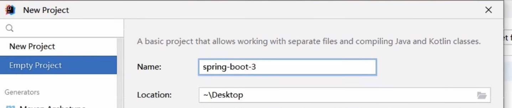


- Create module under it

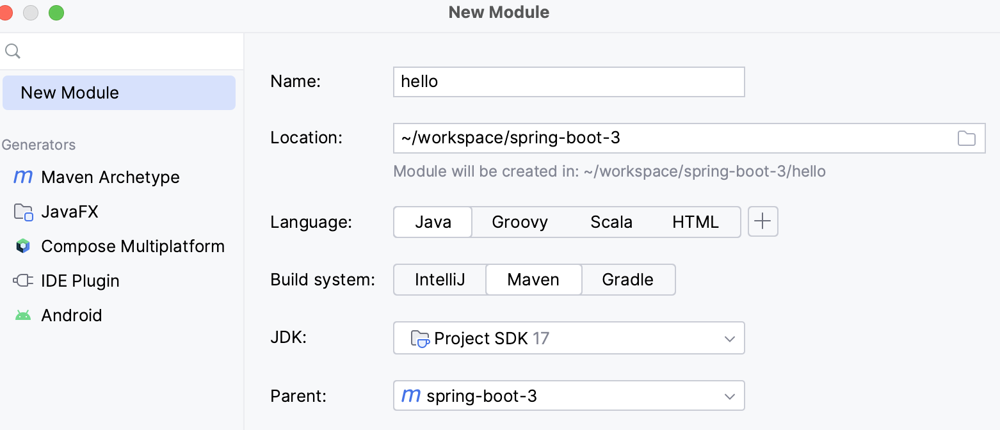

- Minimum pom

Parent -- spring-boot-starter-parent

Dependency -- spring-boot-starter-web

```xml
<?xml version="1.0" encoding="UTF-8"?>
<project xmlns="http://maven.apache.org/POM/4.0.0"
         xmlns:xsi="http://www.w3.org/2001/XMLSchema-instance"
         xsi:schemaLocation="http://maven.apache.org/POM/4.0.0 http://maven.apache.org/xsd/maven-4.0.0.xsd">
    <modelVersion>4.0.0</modelVersion>
    <parent>
        <groupId>org.springframework.boot</groupId>
        <artifactId>spring-boot-starter-parent</artifactId>
        <version>3.0.5</version>
    </parent>

    <artifactId>hello</artifactId>

    <properties>
        <maven.compiler.source>17</maven.compiler.source>
        <maven.compiler.target>17</maven.compiler.target>
        <project.build.sourceEncoding>UTF-8</project.build.sourceEncoding>
    </properties>
    <dependencies>
        <dependency>
            <groupId>org.springframework.boot</groupId>
            <artifactId>spring-boot-starter-web</artifactId>
        </dependency>
    </dependencies>
</project>
```


If you already with a parent then can import as a bom

```xml
    <dependencyManagement>
        <dependencies>
            <dependency>
                <!-- Import dependency management from Spring Boot -->
                <groupId>org.springframework.boot</groupId>
                <artifactId>spring-boot-dependencies</artifactId>
                <version>3.0.5</version>  <!-- Replace with your desired Spring Boot version -->
                <type>pom</type>
                <scope>import</scope>
            </dependency>
        </dependencies>
    </dependencyManagement>
```


set relative path empty can disable find pom in local path

==<relativePath/>==

```xml
    <parent>
        <groupId>org.springframework.boot</groupId>
        <artifactId>spring-boot-starter-parent</artifactId>
        <version>3.0.5</version>
        <relativePath/> <!-- lookup parent from repository -->
    </parent>
```


bootjar plugin

```xml
    <build>
        <plugins>
            <plugin>
                <groupId>org.springframework.boot</groupId>
                <artifactId>spring-boot-maven-plugin</artifactId>
            </plugin>
        </plugins>
    </build>
```


- app & controller

  ```java
  @SpringBootApplication
  public class MyApp {
      public static void main(String[] args) {
          SpringApplication.run(MyApp.class,args);
      }
  }
  ```

  ```java
  @RestController
  public class MyController {
      @GetMapping("/hello")
      public String hello() {
          return "hello";
      }
  }
  ```


# Dependency tree

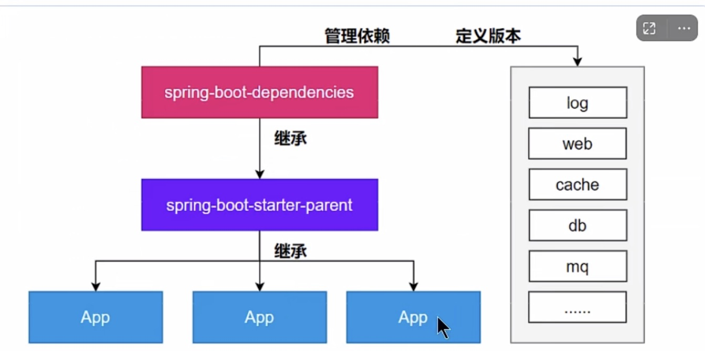


# Log


any starter-> spring-boot-starter -> spring-boot-starter-logging


slf4j + logback


log文件加 -spring使spring接管


log4j2-spring.xml

logback-spring.xml

有了配置文件后，application properties 不再配置logging属性


==导入第三方项目时，先排掉日志包，使用slf4j桥接器，接到你的项目的slf4j上


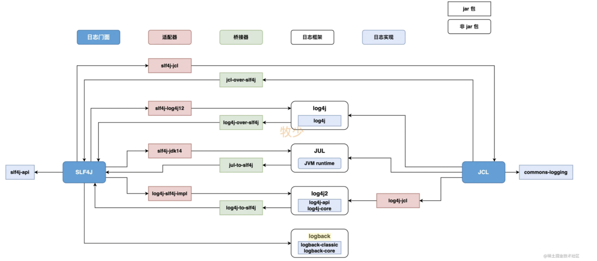

```xml
  <dependencies>
    <dependency>
      <groupId>ch.qos.logback</groupId>
      <artifactId>logback-classic</artifactId>
      <version>1.4.6</version>
      <scope>compile</scope>
    </dependency>
    <dependency>
      <groupId>org.apache.logging.log4j</groupId>
      <artifactId>log4j-to-slf4j</artifactId>
      <version>2.19.0</version>
      <scope>compile</scope>
    </dependency>
    <dependency>
      <groupId>org.slf4j</groupId>
      <artifactId>jul-to-slf4j</artifactId>
      <version>2.0.7</version>
      <scope>compile</scope>
    </dependency>
  </dependencies>
```

logback-classic 适配器

log4j-to-slf4j， jul-to-slf4j 桥接器

use listener to load log system


Property name:

logging.XXX


Setup @ spring-boot.jar -- spring-configuration-metadata.json

```json
    {
      "name": "logging.pattern.console",
      "type": "java.lang.String",
      "description": "Appender pattern for output to the console. Supported only with the default Logback setup.",
      "sourceType": "org.springframework.boot.context.logging.LoggingApplicationListener",
      "defaultValue": "%clr(%d{${LOG_DATEFORMAT_PATTERN:-yyyy-MM-dd'T'HH:mm:ss.SSSXXX}}){faint} %clr(${LOG_LEVEL_PATTERN:-%5p}) %clr(${PID:- }){magenta} %clr(---){faint} %clr([%15.15t]){faint} %clr(%-40.40logger{39}){cyan} %clr(:){faint} %m%n${LOG_EXCEPTION_CONVERSION_WORD:-%wEx}"
    },
```


manually ovr @ properties file

```properties
logging.pattern.console=%d{yyyy-MM-dd HH:mm:ss} %-5level [%thread] %logger{15}: %msg%n
logging.level.root=INFO
logging.level.com.fansy.app.controller=DEBUG
logging.file.name=/Users/hg26502/workspace/spring-boot-3/hello/hg.log
logging.logback.rollingpolicy.file-name-pattern=${LOG_FILE}.%d{yyyy-MM-dd}.%i.gz
logging.logback.rollingpolicy.max-file-size=1KB
```

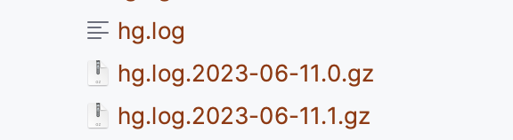

log group

```properties
logging.group.hg=com.fansy.app.controller,com.fansy.app
logging.level.hg=DEBUG

# springboot groups
logging.level.sql=DEBUG
logging.level.web=DEBUG
```


# Profiles

- 配置文件的分环境

​    application.properties

​    application-intg.properties


- bean的分环境

```java
@Bean
@Profile("intg")
public Person person() {}
```

```java
@Component
@Profile("intg")
Pblic class XXX
```


- 环境设置

  在properties文件里设

  ==*spring.profiles.active=intg*==

​	   在代码中设，命令行参数，java参数等等

```java
    public static void main(String[] args) {
        SpringApplication app = new SpringApplication(MyApp.class);
        Map<String, Object> defaultProperties = new HashMap<>();
        defaultProperties.put("spring.profiles.active","intg");
        app.setDefaultProperties(defaultProperties);
        app.run(args);
    }
```


## ConfigurationProperties

```java
@Component
@ConfigurationProperties(prefix = "common.hg")
public class Env {
    private String url;
    private long port;
```


```properties
##application.properties
spring.profiles.active=intg

##application-intg.properties
common.hg.url = www.baidu.com
common.hg.port = 80
```


```java
public class MyController {
    @Autowired
    private Env env;
```


# Junit

- @SpringBootTest("spring.profiles.active=intg")

会init 容器中beans,测试类必须用app的包路径，或子包路径

- dependency

  ```xml
          <dependency>
              <groupId>org.springframework.boot</groupId>
              <artifactId>spring-boot-starter-test</artifactId>
              <scope>test</scope>
          </dependency>
  ```

  会引入junit5 Mockito等


- Junit5

  @BeforeAll 只跑一次

  @BeforeEach 跑n次

- @ParameterizedTest
  @MethodSource("person")

  给测试类传参数


例子

```java
@SpringBootTest("spring.profiles.active=intg")
public class MainTest {
    Logger log = LoggerFactory.getLogger(MainTest.class);
    @Autowired
    Env env;
    String hostInfo;
    @BeforeEach
    public void init() {
        hostInfo = String.format("%s:%d",env.getUrl(),env.getPort());
    }
    @ParameterizedTest
    @MethodSource("person")
    public void testInitLoad(Person p) {
        log.info(String.format("name=%s,age=%d",p.getName(),p.getAge()));
        log.info(hostInfo);
    }
    static Stream<Person> person() {
        Person p = new Person();
        p.setAge(20);
        p.setName("Lee");
        return Arrays.asList(p).stream();
    }
}
```


# 生命周期

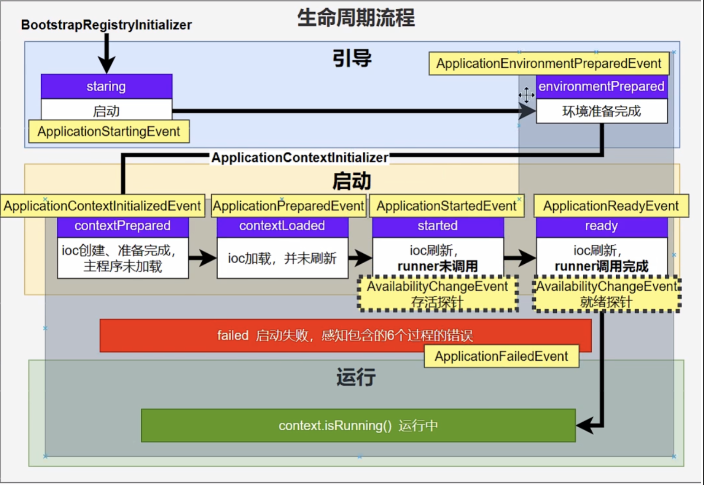


Listener file: spring.factories

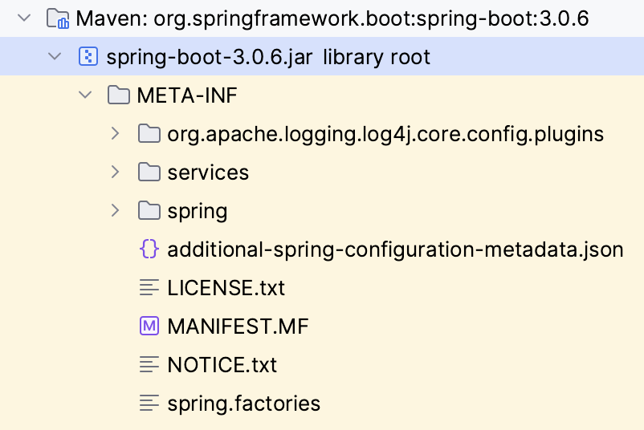

```pro
# spring.factories
# Run Listeners
org.springframework.boot.SpringApplicationRunListener=\
org.springframework.boot.context.event.EventPublishingRunListener
```


可自定义Listener实现SpringApplicationRunListener接口

```java
public class SimpleSpringRunListner implements SpringApplicationRunListener
```

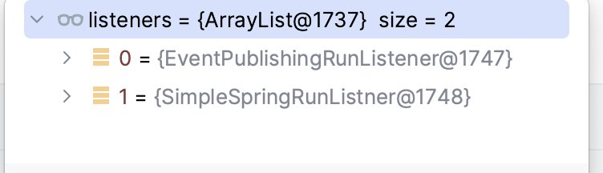

第一个是springboot系统配置的


SpringApplication events

## starting (拉listeners) 

## prepareEnrironment

导properties, outside setDefaultProperties传入的

```java

        if (!CollectionUtils.isEmpty(this.defaultProperties)) {
            DefaultPropertiesPropertySource.addOrMerge(this.defaultProperties, sources);
        }
```


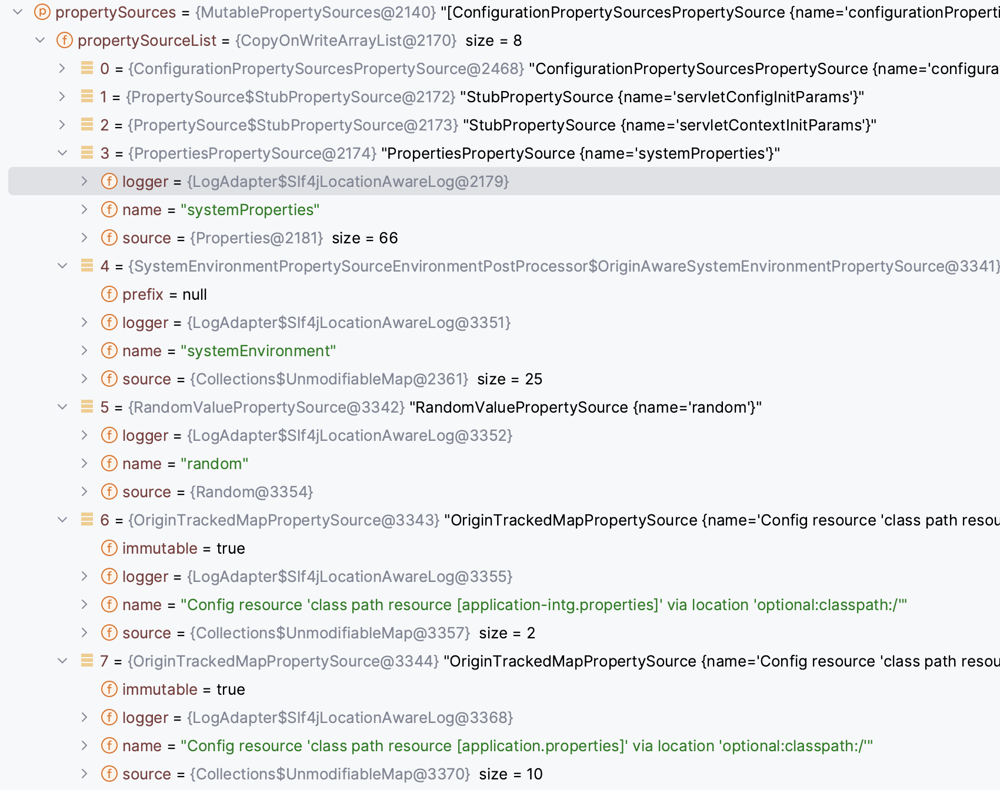


## createApplicationContext

```java
    protected ConfigurableApplicationContext createApplicationContext() {
        return this.applicationContextFactory.create(this.webApplicationType);
    }
```

## prepareContext

Before refresh setup context other things

```java
private void prepareContext(DefaultBootstrapContext bootstrapContext, ConfigurableApplicationContext context, ConfigurableEnvironment environment, SpringApplicationRunListeners listeners, ApplicationArguments applicationArguments, Banner printedBanner) {
    
```

## refreshContext

this is most critical -- bean loadings

this.refreshContext(context);

## afterRefresh

nothing happen, started

## callRunners

this.callRunners(context, applicationArguments);


# CommandLineRunner ApplicationRunner

do something before springboot app ready

SpringApplication::run

```java
listeners.started(context, timeTakenToStartup);
this.callRunners(context, applicationArguments);
```


Sample code

```java
public class SimpleCommandLineRunner implements CommandLineRunner {
    static Logger logger = LoggerFactory.getLogger(SimpleCommandLineRunner.class);
    @Override
    public void run(String... args) throws Exception {
        logger.info("!!!!!SimpleCommandLineRunner is running");
          Optional.ofNullable(args).map(Stream::of)
            .orElseGet(Stream::empty).forEach(logger::info);
    }
}
```


META_INFO/spring.factories

```properties
org.springframework.boot.CommandLineRunner=com.fansy.app.event.SimpleCommandLineRunner
```


# Spring Event publish 


- ApplicationEventPublisher (ApplicationEventPublisherAware)
- Define Event (public class HelloEvent extends ApplicationEvent)
- Define EventListener (@EventListener)


sample

```java
public class MyController implements ApplicationEventPublisherAware {

    ApplicationEventPublisher applicationEventPublisher;
  
    @GetMapping("/hello")
    @ResponseBody
    public String hello() {
        log.debug("hello, hello!!!!!!!!!!");
        log.info(String.format("%s:%d", env.getUrl(),env.getPort()));
        applicationEventPublisher.publishEvent(new HelloEvent("hello, hello!!!!!!!!!!"));
        return "hello";
    }
```


```java
public class HelloEvent extends ApplicationEvent {
    public HelloEvent(String source) {
        super(source);
    }
}
```


```java
@EventListener
public void consumeHelloEvent(HelloEvent helloEvent) {
    logger.info(String.format("!!!!!Event received: %s", helloEvent.getSource()));
}
```


# Springboot 加载原理


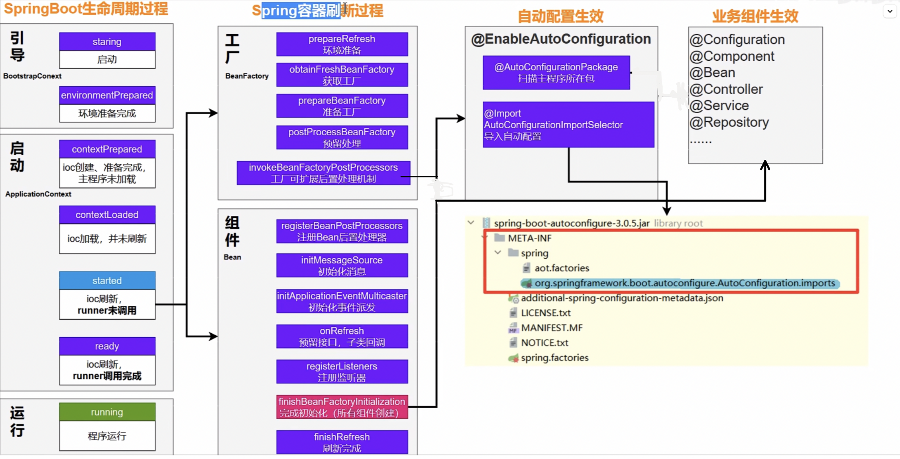


@SpringBootApplication

- @EnableAutoConfiguration
  - @AutoConfigurationPackage -- 扫描app类所在package的component，加入spring容器
  - @Import(AutoConfigurationImportSelector.class) -- spi机制加载 META-INF/spring/...... 下所有列出的AutoConfiguration的类


# AutoConfiguration


- define @EnableXXX annotation class, use this class import config class

  ```java
  @Retention(RetentionPolicy.RUNTIME)
  @Target({ElementType.TYPE})
  @Documented
  @Import(RobotAutoConfiguration.class)
  public @interface EnableRobot
  ```

  ```java
  @Import({RobotProperties.class, RobotService.class})
  @Configuration
  public class RobotAutoConfiguration {
      @Bean //把组件导入到容器中
      public RobotController robotController(){
          return new RobotController();
      }
  }
  ```

- use SPI

  Create new module

  ```xml
  ##pom.xml
  <groupId>com.fansy</groupId>
  <artifactId>hg-simple-starter</artifactId>
  
  <dependencies>
      <dependency>
          <groupId>org.springframework.boot</groupId>
          <artifactId>spring-boot-autoconfigure</artifactId>
          <scope>compile</scope>
      </dependency>
      <dependency>
          <groupId>org.springframework.boot</groupId>
          <artifactId>spring-boot-starter-logging</artifactId>
          <scope>compile</scope>
      </dependency>
      <dependency>
          <groupId>org.projectlombok</groupId>
          <artifactId>lombok</artifactId>
          <scope>provided</scope>
      </dependency>
  </dependencies>
  ```

  

  Write AutoConfiguration class

  ```java
  @AutoConfiguration
  @ConditionalOnProperty(
          prefix = "hg.simple",
          name = {"auto"},
          havingValue = "true",
          matchIfMissing = false
  )
  public class HgSimpleAutoConfiguration {
      @Bean
      public SimpleHgService simpleHgService() {
          return new SimpleHgService();
      }
  
      @Bean
      public HgSimpleProperty hgSimpleProperty() {
          return new HgSimpleProperty();
      }
  }
  
  ```

  

Write SPI


```sh
com.fansy.simple.HgSimpleAutoConfiguration
```


when other mudole using hg-simple-starter, write properties:

```java
hg.simple.auto = true
hg.simple.name = haining
hg.simple.value = 20230622
```


```java
@Autowired
private SimpleHgService simpleHgService;
```


# HttpServiceProxy

call a restful http, by a proxy style

```xml
        <dependency>
            <groupId>org.springframework.boot</groupId>
            <artifactId>spring-boot-starter-webflux</artifactId>
        </dependency>
```


## define interface

Interface should point to real http url

```java
public interface HelloProxy {
    @GetExchange(url = "http://localhost:8888/hello", accept = MediaType.TEXT_PLAIN_VALUE)
    Mono<String> doHello();

    @GetExchange(url = "http://localhost:8888/sum", accept = MediaType.TEXT_PLAIN_VALUE)
    Mono<String> doSum(@RequestParam("num") int num);
}
```


## Config to weave HelloProxy

webClient -> HttpServiceProxyFactory -> HelloProxy

```java
    @Bean
    WebClient webClient() {
        HttpClient httpClient = HttpClient.create()
                .option(ChannelOption.CONNECT_TIMEOUT_MILLIS, 10000) // 连接超时
                .doOnConnected(conn -> conn.addHandlerLast(new ReadTimeoutHandler(10, TimeUnit.SECONDS))); // 读取超时
        return WebClient.builder().clientConnector(new ReactorClientHttpConnector(httpClient)).build();
    }

    @Bean
    HttpServiceProxyFactory httpServiceProxyFactory(WebClient webClient) {
        return HttpServiceProxyFactory.builder(WebClientAdapter.forClient(webClient)).build();
    }

    @Bean
    HelloProxy helloProxy(HttpServiceProxyFactory httpServiceProxyFactory) {
        return httpServiceProxyFactory.createClient(HelloProxy.class);
    }
```


## Using HelloProxy

```java
HelloProxy helloProxy = ctx.getBean(HelloProxy.class);
System.out.println("!!!!!!!" + helloProxy.doSum(100).block());
```


# Kafka


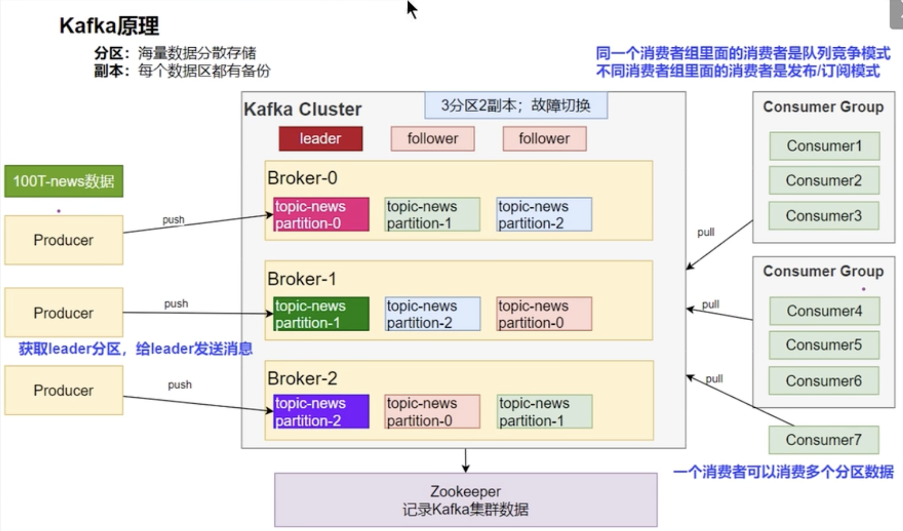 


## add docker's Kafka name into your os hosts mapping

```sh
(base) hg26502@192 ~ % sudo vi /etc/hosts
(192.168.31.88   5241093bb787)
(base) hg26502@192 ~ % sudo killall -HUP mDNSResponder
```


## Add depedency

```xml
        <dependency>
            <groupId>org.springframework.kafka</groupId>
            <artifactId>spring-kafka-test</artifactId>
            <scope>test</scope>
        </dependency>

        <dependency>
            <groupId>org.springframework.kafka</groupId>
            <artifactId>spring-kafka</artifactId>
        </dependency>
```


## Config properties

kafka msg key value need Serializer 

```properties
spring.kafka.bootstrap-servers=192.168.31.88:9092
spring.kafka.producer.key-serializer=org.apache.kafka.common.serialization.StringSerializer
spring.kafka.producer.value-serializer=org.springframework.kafka.support.serializer.JsonSerializer
```


## Send msg

by template

```java
@SpringBootTest("spring.profiles.active=intg")
@Slf4j
public class KafkaTest {
    @Autowired
    KafkaTemplate template;

    @Test
    public void testSendMsg() {
        StopWatch watch = new StopWatch();
        watch.start();
        CompletableFuture[] futures = IntStream.rangeClosed(1, 10000).mapToObj(i ->{
            Person p = new Person("Lee",i);
            return sendMsg(p, String.format("person%d",i));
        }).toArray(CompletableFuture[]::new);

        CompletableFuture.allOf(futures).join();
        watch.stop();
        log.info(String.format("Time Millis: %d",watch.getTotalTimeMillis()));
    }
    public CompletableFuture sendMsg(Person p, String key) {
        return template.send("news", key,p);
    }
}
```


## Consume msg

simply use annotation

@EnableKafka

@KafkaListener

```java
@EnableKafka
@SpringBootApplication
public class MyApp {
  
  
```

```java
@Component
@Slf4j
public class SimpleKafkaListener {

    @KafkaListener(topics={"news"}, groupId="hgListener")
    public void doListen(ConsumerRecord record) {
        log.info(String.format("key:%s, value:%s", record.key(),record.value()));
    }
}
```


# Spring Security


Define a SecurityFilterChain for yourself

Define how to UserDetailsService, for login verify


```java
@EnableMethodSecurity
@Configuration
public class AppSecurityConfiguration {

    @Bean
    SecurityFilterChain securityFilterChain(HttpSecurity http) throws Exception {
        //请求授权
        http.authorizeHttpRequests(registry -> {
            registry.requestMatchers("/").permitAll() //1、首页所有人都允许
                    .anyRequest().authenticated(); //2、剩下的任意请求都需要 认证（登录）
        });

        //表单登录
        //3、表单登录功能：开启默认表单登录功能；Spring Security提供默认登录页
        http.formLogin(formLogin -> {
            formLogin.loginPage("/login").permitAll(); //自定义登录页位置，并且所有人都能访问
        });

        return http.build();
    }

    @Bean //查询用户详情；
    UserDetailsService userDetailsService(PasswordEncoder passwordEncoder){
        UserDetails zhangsan = User.withUsername("zhangsan")
                .password(passwordEncoder.encode("123456")) //使用密码加密器加密密码进行存储
                .roles("admin", "hr")
                .authorities("file_read", "file_write")
                .build();

        UserDetails lisi = User.withUsername("lisi")
                .password(passwordEncoder.encode("123456"))
                .roles("hr")
                .authorities("file_read")
                .build();

        UserDetails wangwu = User.withUsername("wangwu")
                .password(passwordEncoder.encode("123456"))
                .roles("admin")
                .authorities("file_write","world_exec")
                .build();

        //默认内存中保存所有用户信息
        InMemoryUserDetailsManager manager = new InMemoryUserDetailsManager(zhangsan,lisi,wangwu);
        return manager;
    }


    @Bean //密码加密器
    PasswordEncoder passwordEncoder(){
        return new BCryptPasswordEncoder();
    }
}
```


authorize by role or by authority

```java
        UserDetails wangwu = User.withUsername("wangwu")
                .password(passwordEncoder.encode("123456"))
                .roles("admin")
                .authorities("file_write","world_exec")
                .build();

->
@PreAuthorize("hasAuthority('world_exec')")
    @GetMapping("/world")
    public String world(){
        return "Hello World!!!";
    }
```


# Actuator & Prometheus

http://localhost:8888/actuator/

Metrics, env, configprops

pom.xml

```xml
        <dependency>
            <groupId>org.springframework.boot</groupId>
            <artifactId>spring-boot-starter-actuator</artifactId>
        </dependency>
        <dependency>
            <groupId>io.micrometer</groupId>
            <artifactId>micrometer-registry-prometheus</artifactId>
        </dependency>
```


expose all endpoints

```properties
#actuator
management.endpoints.web.exposure.include=*
management.endpoint.health.enabled=true
management.endpoint.health.show-details=always
```


## self define health check

http://localhost:8888/actuator/health

result

```json
"my":{"status":"UP","details":{"code":200}}
```


you add code like this

```java
@Component
public class MyHealthIndicator extends AbstractHealthIndicator {
    @Autowired
    MyController testController;
    @Override
    protected void doHealthCheck(Health.Builder builder) throws Exception {
        String result = testController.hello();
        if(StringUtils.hasLength(result)) {
            builder.up().withDetail("code",200);
        } else {
            builder.down().withDetail("code",500);
        }
    }
}
```


## self define metrics check

pom.xml

```xml
        <dependency>
            <groupId>io.micrometer</groupId>
            <artifactId>micrometer-registry-prometheus</artifactId>
        </dependency>
```


code

MeterRegistry meterRegistry -- add a counter

when the method invoked count ++


Monitor @ url

`http://localhost:8888/actuator/metrics/hg.sayHello.tiems`

```java
public class SimpleHgService {
    @Autowired
    HgSimpleProperty hgSimpleProperty;

    Counter counter;
    public SimpleHgService(MeterRegistry meterRegistry) {
        counter = meterRegistry.counter("hg.sayHello.times");
    }
    public void sayHello() {
        log.info("HgSimpleAutoConfiguration enabled");
        log.info(String.format("name=%s, value=%s",hgSimpleProperty.getName(),hgSimpleProperty.getValue()));
        counter.increment();
    }
}
```


## grafana & prometheus

Url

admin/198263

http://192.168.31.88:3000/?orgId=1


http://192.168.31.88:9090/graph?g0.expr=&g0.tab=1&g0.stacked=0&g0.show_exemplars=0&g0.range_input=1h


Add pom then actuator will have metrics

http://localhost:8888/actuator/prometheus

```xml
        <dependency>
            <groupId>io.micrometer</groupId>
            <artifactId>micrometer-registry-prometheus</artifactId>
        </dependency>
```


### Check promethues in docker's bind

docker inspect prometheus|less

```xml
            {
                "Type": "bind",
                "Source": "/root/prod/prometheus.yml",
                "Destination": "/etc/prometheus/prometheus.yml",
                "Mode": "rw",
                "RW": true,
                "Propagation": "rprivate"
            },
```


Modify /root/prod/prometheus.yml

```yml
  - job_name: 'hello'
    metrics_path: '/actuator/prometheus'
    static_configs:
      - targets: ['192.168.31.117:8888']
        labels:
          nodename: 'hello'
```


promethues targets page can see it:

http://192.168.31.88:9090/targets?search=#pool-hello

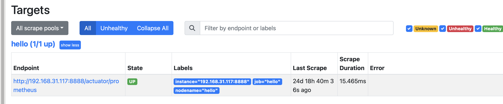


Copy graphana dashboard id

https://grafana.com/grafana/dashboards/11157-druid-connection-pool-dashboard/

12900


Set promethues datasource @ graphana

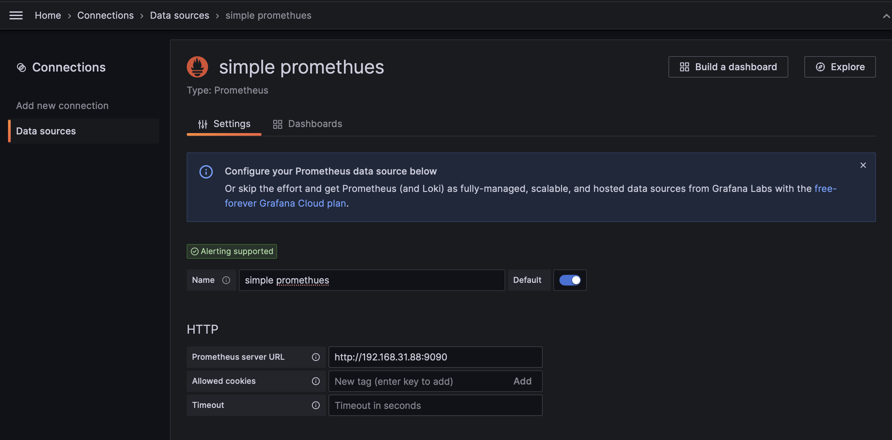


import into graphana

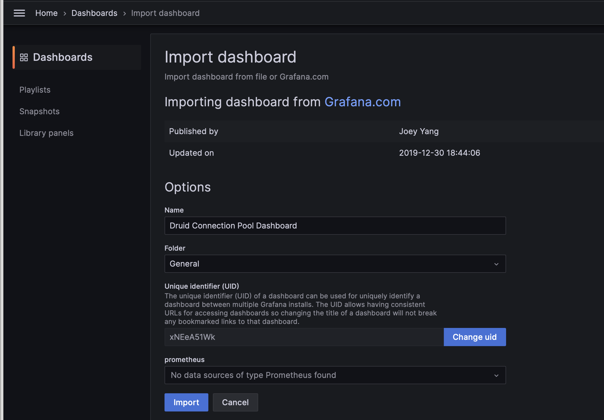


dash board like this

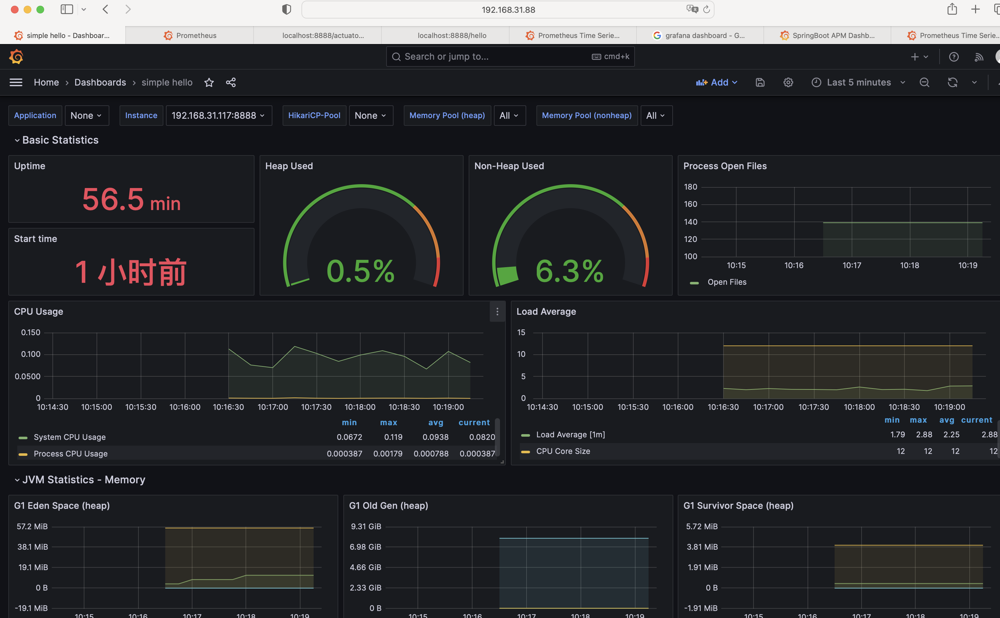


# Log

- 桥接使当前代码指向slf4j， 例如代码中用的是JUL， 使用jul-to-slf4j桥接到slf4j
- 适配器是真正log的实现绑定，例如代码使用slf4j,配置使用log4j2.xml，你需要用log4j-slf4j-imple适配器使log4j2真正工作

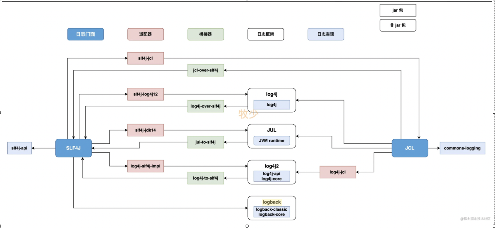


Spring-jcl整合了JCL(apache commons logging)  -- LogAdapter will 

apache commons logging是门面，真正的实现LogAdapter会根据ClassLoader中有哪个实现就使用哪个


Springboot(spring-boot-start-logging)使用slf4j做门面，JCL的 LogAdapter看到有SLF4J会把实现自动转过来。但是你必须把apache commons logging排掉。

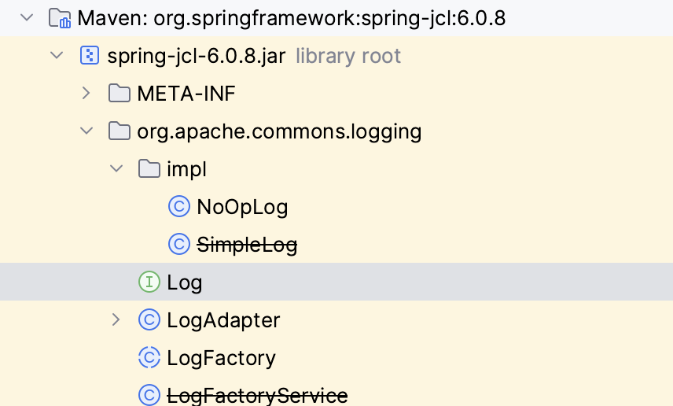


# Spring bean initializing

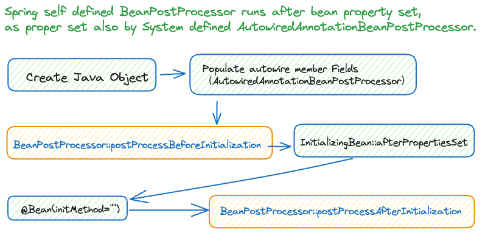
