#mac

资源库 -- 事件 -- 项目 -- 素材（按照关键词分类）
# Tips
关闭后台渲染
![[Pasted image 20231105183650.png|500]]

改成手动渲染
![[Pasted image 20231105183844.png|275]]

---

## 素材 
按 I O 截取 
按==斜线/ 预览选取的片段==
option 点任意地方取消选取
command 可在一个素材上选取多个片段

点小锁 给素材加关键词

 F U 收藏 取消收藏
 delete U 拒绝取消拒绝

## 切割速度

切割之后 拉拽中间 左右分别 快速慢速常速等等
即时重放 可把片段重放

P6检查器待续

# 检查器

选取录像右上区域

# 时间轴

Shift Z  合理化时间轴，必用

点时间输入可精确定位

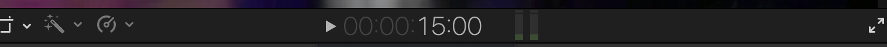

素材添加到时间轴的四种方式

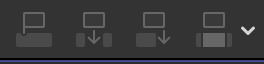

1. 叠加
2. 穿插
3. 添在末尾
4. 用所选视频覆盖时间线所在位置视频

==时间轴==的所有元素可在左下寻找改名分类：视频， 音频，字幕
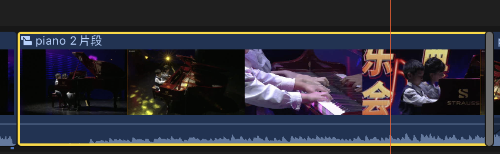

# ！！！时间轴操作

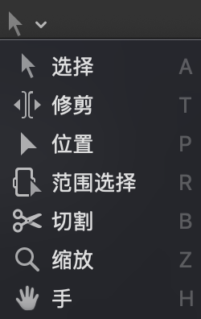

## 修剪

对于选定的段可拉伸长度

用 option [     ], 截头截尾

## 位置

移动可以留白
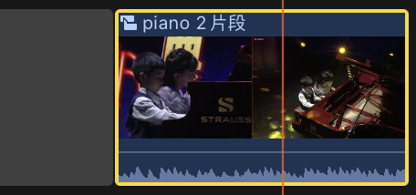

## 范围选择
选一个范围设置属性，删除，速度调整

## 切割

最常用

command b 剪时间轴所在位置
shift command b 剪这个时间轴
被剪开的片段可以用菜单栏接合
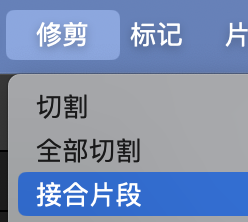

## 缩放

放大一个片段， 精剪
按住option  可以缩小
也可用command + - 直接缩放

# 右下

1，2 视频音频滑动 skim

3 单独播放选中段

4 吸附 -- 插入视频定位时非常有用

5 片段的外观修改

# ！！！时间轴快捷键

剪辑状态下 --

- 帧剪辑

==大于号 小于号 选择块时间不变 选择块前面的块时间被拉长缩短==

Shift > < 可加大微调尺度

但是选择块后面还有视频不要用会乱

- 滑动剪辑

在修剪下， 按住option 鼠标拖选择块， 会改变前后块时间，自己不变

- 分层剪辑（太乱）
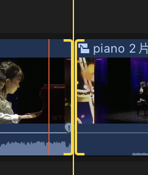

双击中间展开图层
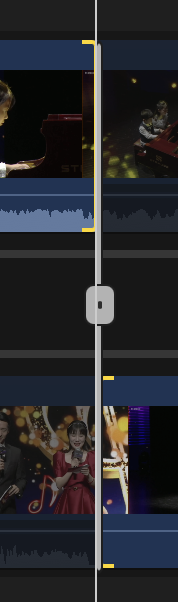
双击中间的bar 恢复成一层

# 其他快捷键

JKL 正放 停 倒放

/ 循环放

上 下键 到下一个片段开头或结尾

# 替换和试演

选择一个素材，去覆盖时间轴上的片段
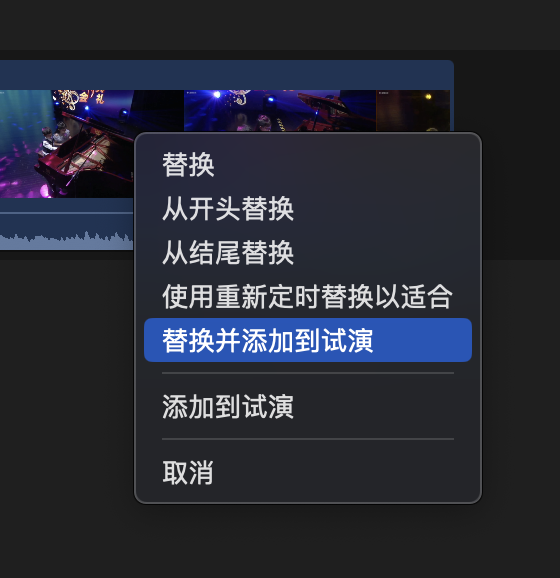

点上面小帽子选择两个试演，最后决定需要的点完成
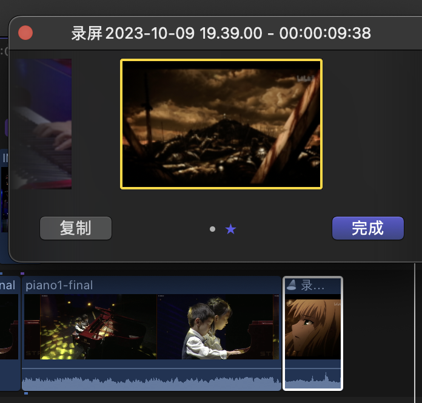

还可以复制后加效果， 三选一

# 画中画

## 变换

叠加在别的涂层上面，形成画中画
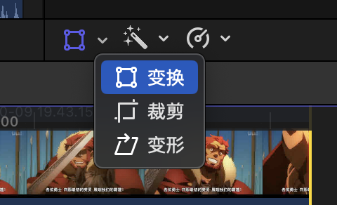

## 裁剪的三个选项

修剪获取一个局部，裁剪是等比例缩放
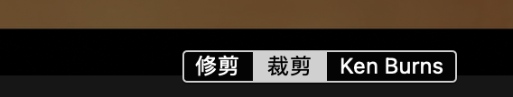
Ken Burns

动态放大或缩小图片

## 变形

把视频拉到图里的电视框之类

# 调色

平衡颜色

点击后在右上检查器调整
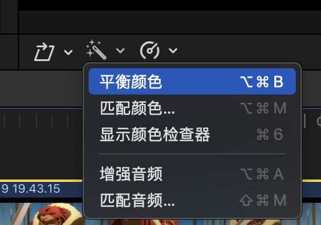

匹配颜色

用一帧的颜色匹配所有画面

点击应用匹配项

# 静止帧
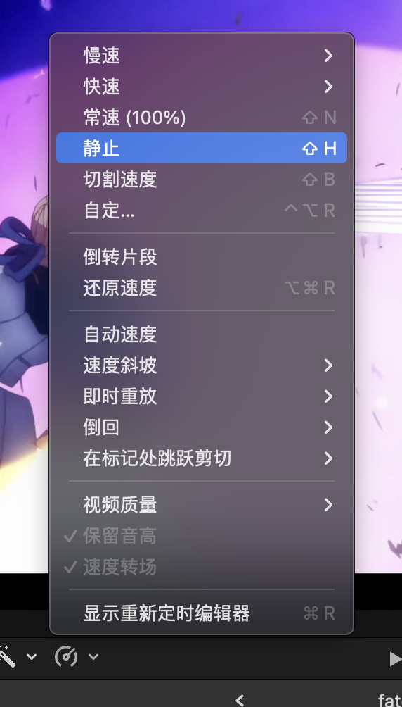

插入一个静止帧

速度

选自定， 选速率50%， 波纹取消， 时间不变结尾点变化了

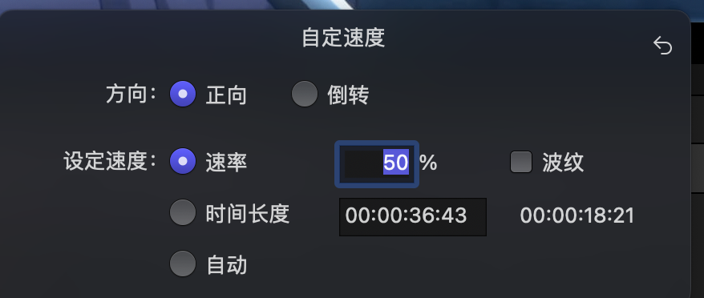

# 卡点视频

卡点视频，非常常用

==M 给音乐标记==

==ctrl + ;或者"前后移动==

==Ctrl + ><挪动标记位置==

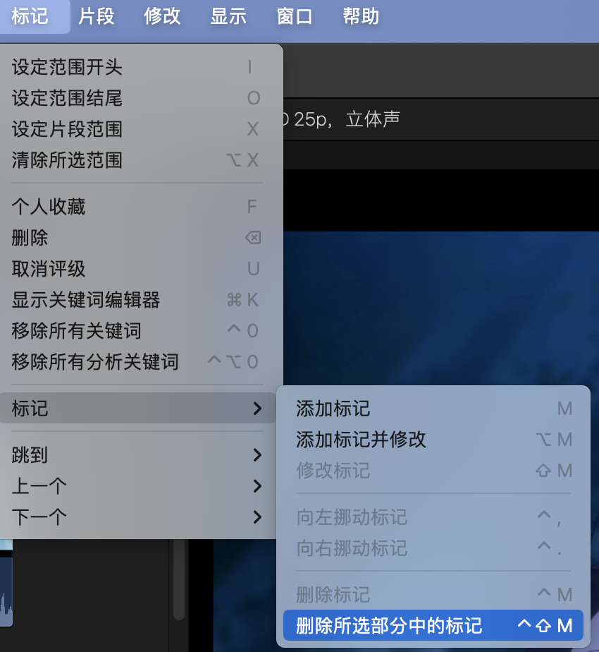

用菜单可去除所有标记

CMD + T 插入转场

复制项目

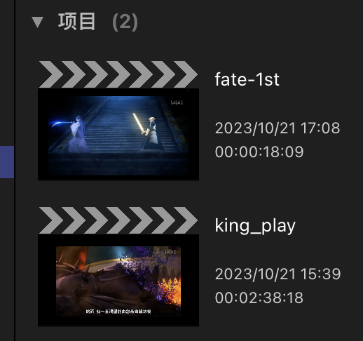

使编排的时间轴独立不会相互影响

# 关键帧缩放

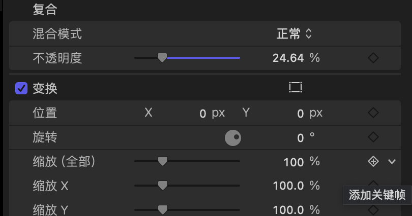

选取几个关键帧改变缩放 ==option + 点击==(ctrl V 之后才能使用)

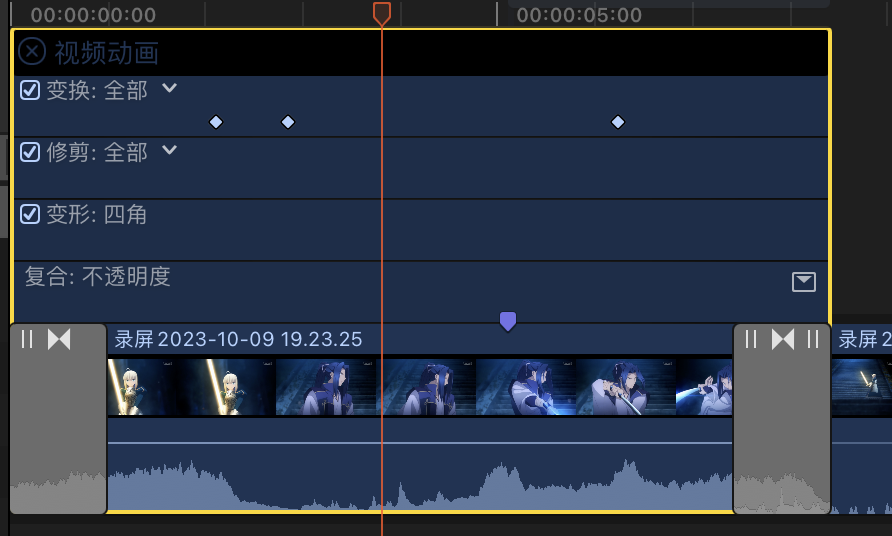

==ctrl V== 显示关键帧位置还能拖拽改变
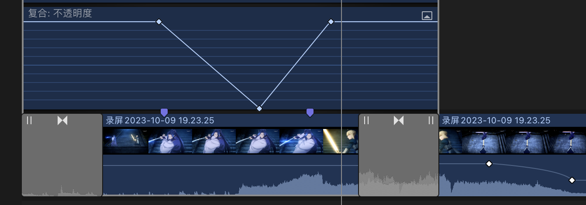

 
# 蒙版调色
option 向上托视频 复制一个新的视频
使用效果的绘制蒙版
![[Pasted image 20231202195022.png|425]]

用钢笔勾出范围 然后调色
![[Pasted image 20231202195220.png|500]]

调完后把羽化推上去

# ！！！粗剪

F -- 显示个人收藏
U -- 取消收藏

剪视频不剪音乐， 要选位置（option w可创建空白片段 ） 

# 2024 relearn

资源库 -- 事件 -- 项目

事件用来容纳导入素材
项目用来建立时间线

>[!note]+ 选中一个素材 delete 会标红， 快捷键u 取消删除

事件中可以建文件夹保存关键词

## 粗剪
cmd +- 缩放， io选取， F收藏

>[!note]+ jkl 后退 暂停 前进， 按住K 再按JL逐帧进退

; 上一个编辑点 ‘下一个编辑点

## 角色
分配视频音频角色后可以自动分轨
![[Pasted image 20240404192925.png|325]]

## 三点剪切大法
option w插入一段空白时间
M 打点
ctrl ;' 可跳到下一个M点

按D插入视频

Ctrl T 加字幕

选择范围可以对范围音量直接调整

## 剪切
按住B + 鼠标左键 切割
cmd B 直接减
shift cmd B 切整条时间线

shift ？试听前后2秒

## 填充

利用填充做背景模糊效果
![[Pasted image 20240404205356.png|325]]

option cmd 上下换时间线位置
option 上 复制

窗口 -- 录制画外音

## 调色

调出色板，用色轮调节
cmd c ， cmd shift v黏贴效果
![[Pasted image 20240405075707.png|425]]
![[Pasted image 20240405075739.png|500]]

## 去水印
![[Pasted image 20240405081312.png]]