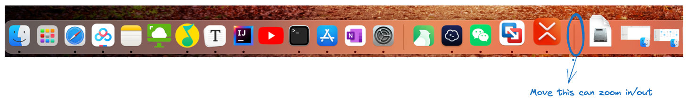

#mac 
文件夹也可放程序坞

OPTION CMD D 显示或隐藏程序坞

---
# 输入法快捷键
去除ctrl space切换
![[Pasted image 20231022204552.png]]
## ==设置地球仪切输入法==
![[Pasted image 20231022204830.png]]

---
# 状态栏可以拖到菜单上
![[Pasted image 20231022205313.png]]

按住CMD可移除
![[Pasted image 20231022212413.png]]
# 触发角
![[Pasted image 20231022205606.png]]